# Hot Stock

## 프로젝트 소개

- 프로젝트명: HotStock
- 서비스 소개 : 실시간 뉴스 기사를 크롤링하여 키워드를 추출하고, 자주 등장한 키워드들과 연관된 테마 및 주식을 추천하는 서비스

## 프로젝트 타겟층

- 대중의 관심이 모이는 종목에 미리 투자하고 싶은 사람
- 아는 주제에 맞춘 투자로 어려운 투자를 쉽게 하고 싶은 사람

## [프로젝트 소개 ppt](https://www.canva.com/design/DAFwWVZcgZg/jhwmADGLeMJSAA5dIjPy4g/view?utm_content=DAFwWVZcgZg&utm_campaign=share_your_design&utm_medium=link&utm_source=shareyourdesignpanel)

## [프로젝트 시연 영상 링크](https://youtu.be/oERbRGcNkV8)

## 프로젝트 시연 시나리오

### 1. 메인 페이지

---
### 2. 키워드 세부 페이지

---
### 3. 종목 세부 페이지

---
### 4. 랭킹 페이지

---
### 5. 테마 페이지

---
### 6. 테마 세부 페이지

---
### 7. 서비스 소개 페이지

## 프로젝트 아키텍쳐

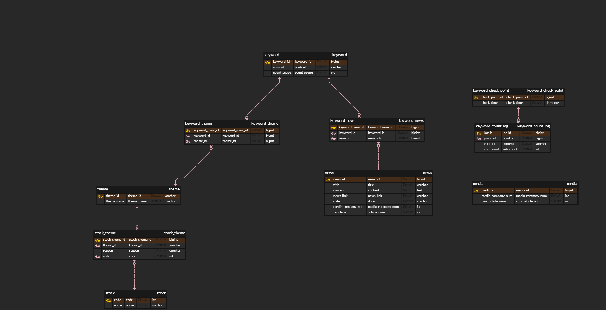

## 프로젝트 ERD

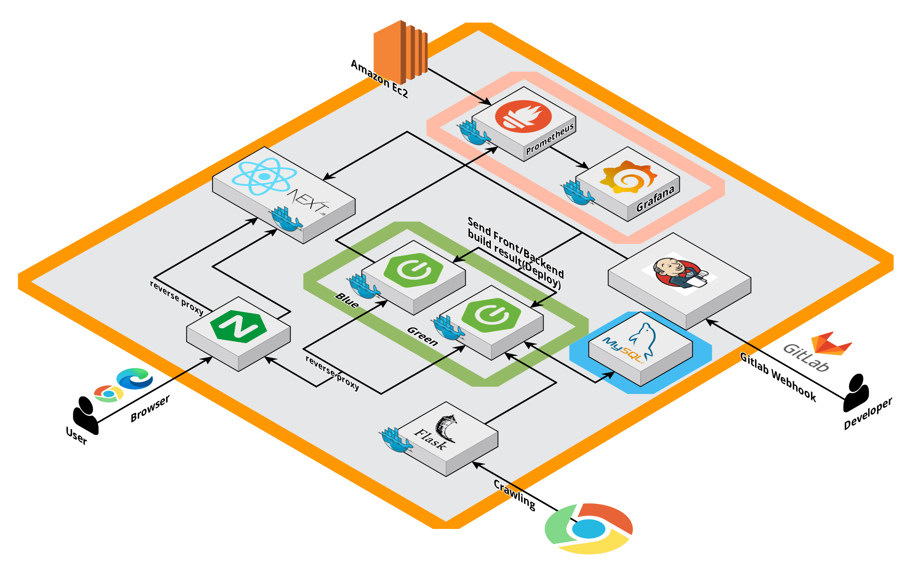

## 개발 기간

23.08.28(월) ~ 23.10.06(금)  -  6주

## 팀 소개

- 나현웅: 팀장, python-api 서버 구축 및 성능 향상
- 김민우: 부팀장, Fullstack 개발
- 김현수: Backend Leader
- 윤혜민: Frontend Leader
- 정지원: Infra Leader, CI/CD 구축
- 주창훈: Backend Leader, UCC Leader

## 상세 기능

- 네이버 뉴스 기사 크롤링
- 뉴스 기사에서 키워드를 추출
- 키워드의 랭킹화를 바탕으로 워드클라우드 생성
- 키워드와 연관된 주식 테마 추천
- 테마와 연관된 주식 추천
- 주식 종목 검색

## 활용  기술

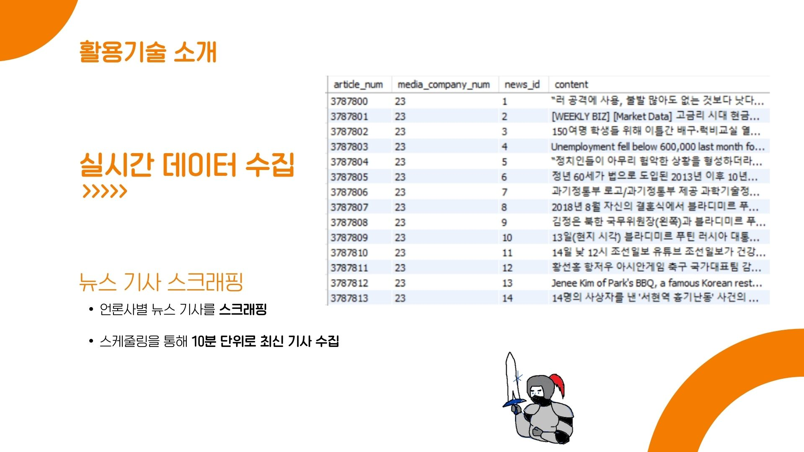

---

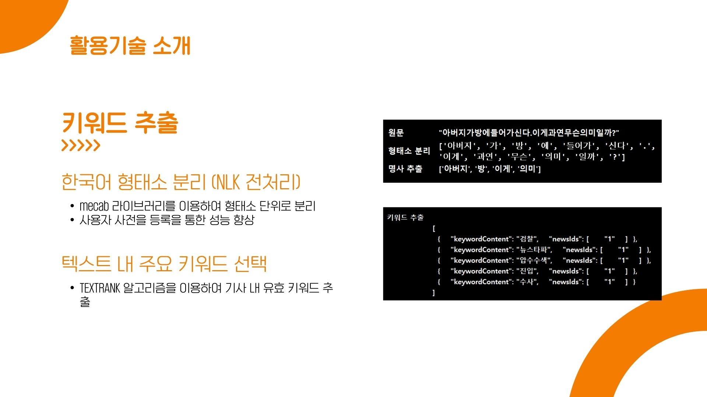

---

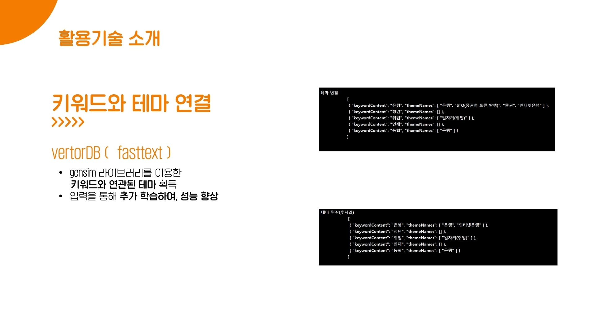

---

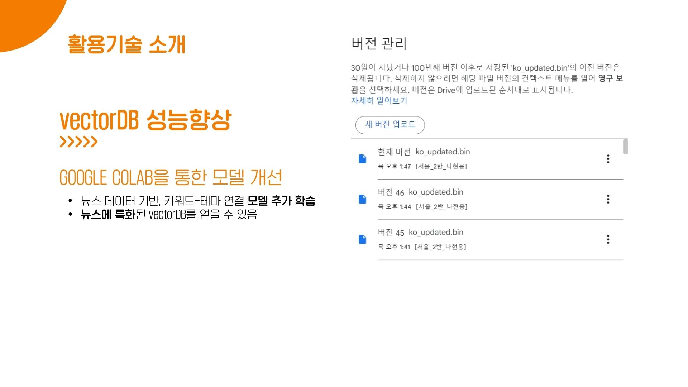

---

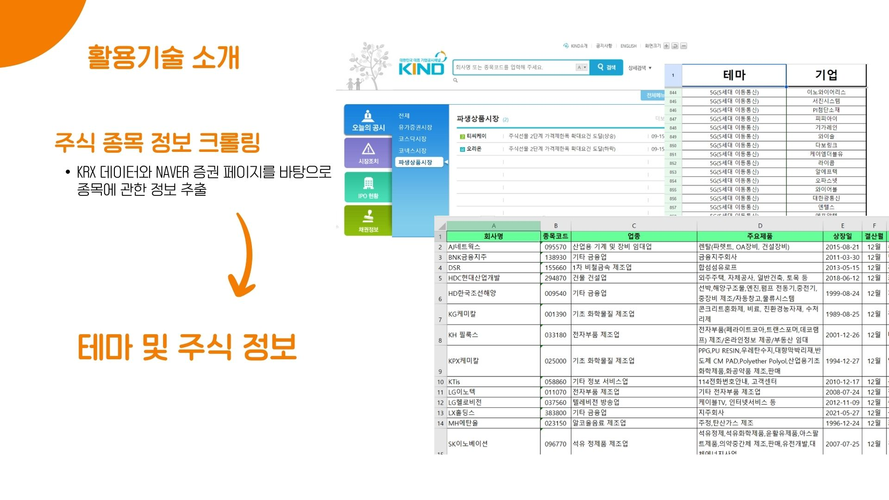

---

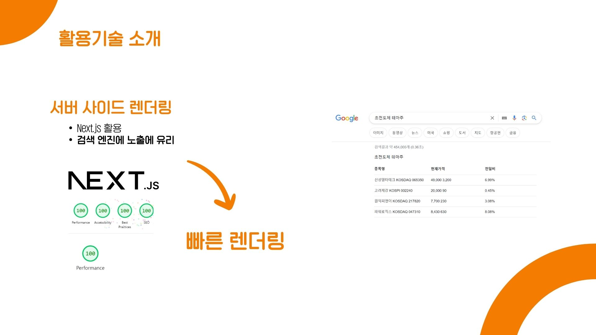

---

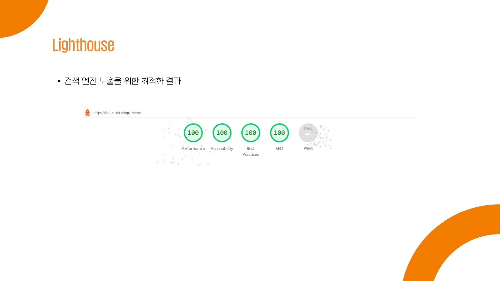

---

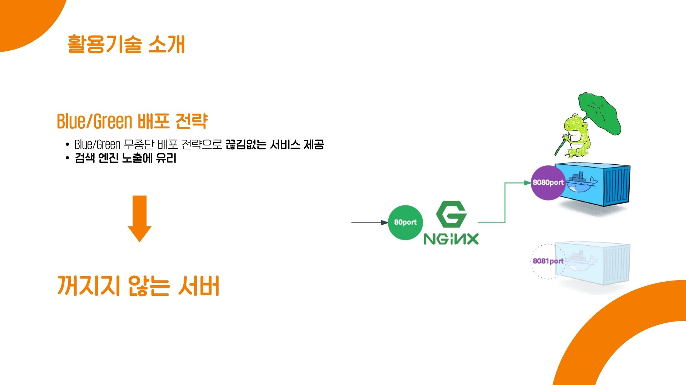

---

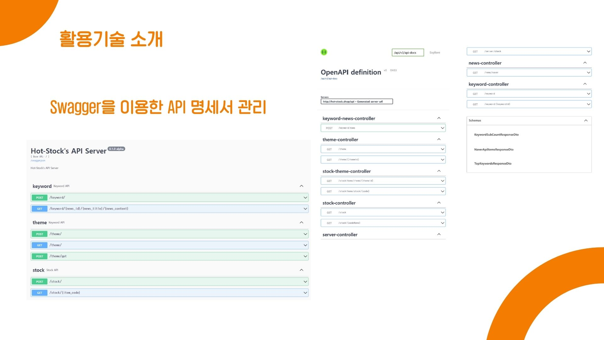

---

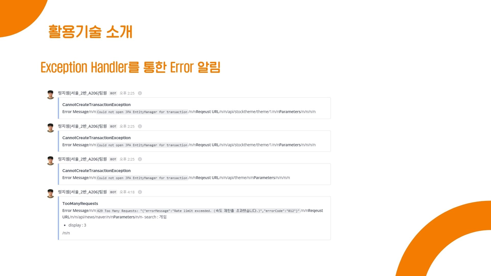

---

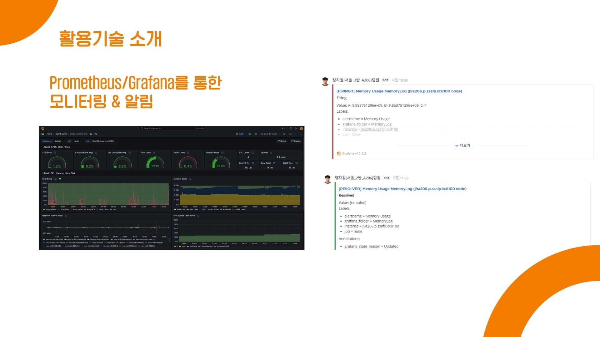

## 컨벤션

1. Git flow
2. Jira

## 기술 스택

### 형상 관리

- `GitLab`

### 이슈 관리

- `Jira`

### 커뮤니케이션

- `Mattermost`
- `Notion`

### IDE

- `Intellij CE 2023.1.3`
- `Visual Studio Code`
    - vim

### Server

- `AWS EC2 t2.xlarge`
    - `Ubuntu 20.04`
    - `Docker 24.0.6`
    - `Nginx 1.18.0`

### Frontend

- `React`
    - `next.js 13.4.19`
- `node.js 18.16.1`
- `tailwind 3.3.3`

### Backend

- `Java OpenJDK 17.0.8`
- `SpringBoot 3.1.3`
- `Gradle 8.2.1`

Dependencies

    - Spring Data JPA
    - Lombok
    - Swagger
    - actuator
    

    

     
- `python 3.11.5`

requirements

    - Flask==2.3.3
    - Flask-Cors==4.0.0
    - flask-restx==1.1.0
    - python-mecab-ko==1.3.3
    - krwordrank==1.0.3
    - gensim==4.3.2
    - openai==0.28.0
    - gdown==4.7.1
    - gunicorn==21.2.0
    

    

### Database

- `MySQL 8.0.34 (on AWS RDS)`

### Infra

- `Jenkins 2.414.1`
- `docker-compose 2.16.0`
- `prometheus 2.47.0`
- `grafana 10.1.2`

 
